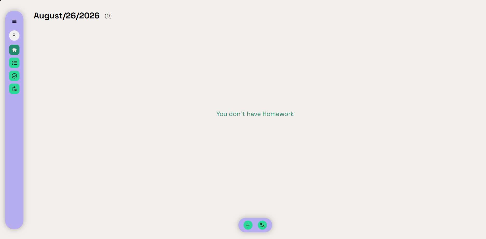
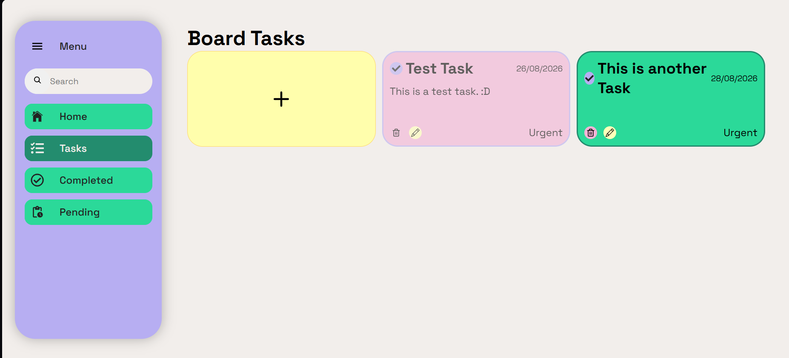

# To-Do List

## Tabla de Contenido

* [1. Introducción](#1-introducción)
* [2. Objetivos](#2-objetivos)
* [3. Diseño](#3-diseño)
* [4. Tecnologías](#4-tecnologías)
* [5. Mantenimiento](#5-mantenimiento)
* [6. Imágenes](#6-imágenes)
## 1. Introducción

Este es un To-Do List web con la capacidad de gestionar tareas en diferentes estados, mostrando la información correspondiente y siendo capaz de mantener organizadas las tareas por su estado actual. 

## 2. Objetivos

El objetivo principal es tener un espacio limpio y fácil de usar donde poder gestionar y crear tareas diarías.
Adicionalmente este proyecto tenía como objetivo servir como ejercicio practico para poner a prueba mis conocimientos en el uso de Hooks, Componentes, Typescript y uso de estados globales.

## 3. Diseño

* La web cuenta con un menu desplegable para mostrar más o menos información dependiendo del gusto del usuario. Cuenta con un pantalla principal, donde se mostrarán las tareas correspondientes al día actual, en su cabecera cuenta con la fecha y la cantidad de tareas que hay para el día. En dado caso que no hayan tareas, se mostrará un mensaje "You don't have Homework"

* Una segunda vista se mostrarán todas las tareas de manera general, dispuestas en un grid de 3 columnas con filas dinámicas.

* En una tercera y cuarta vista se mostrarán las tareas completadas o incompletas.

## 4. Tecnologías

* HTML / CSS
* REACT
* TypeScript

## 5. Mantenimiento

Planeo seguir mejorando esta página implementando lo siguiente:
* Conexión a una base de datos SQL (PostgreSQL)
* Persistencia de datos en memoría local (Tema de colores)
* Login para ser capaz de usar por diferentes usuarios

## 6. Imágenes

